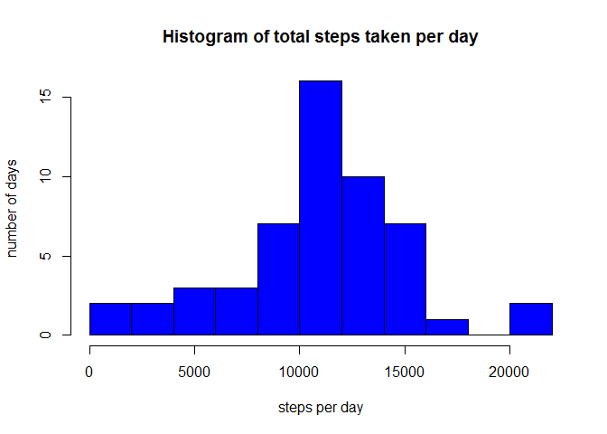
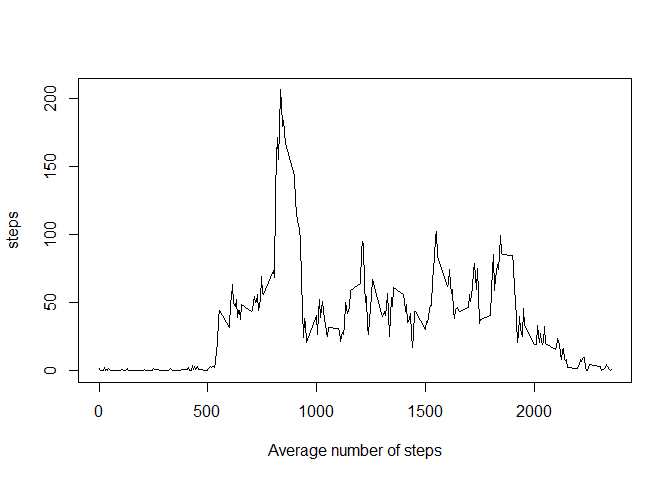
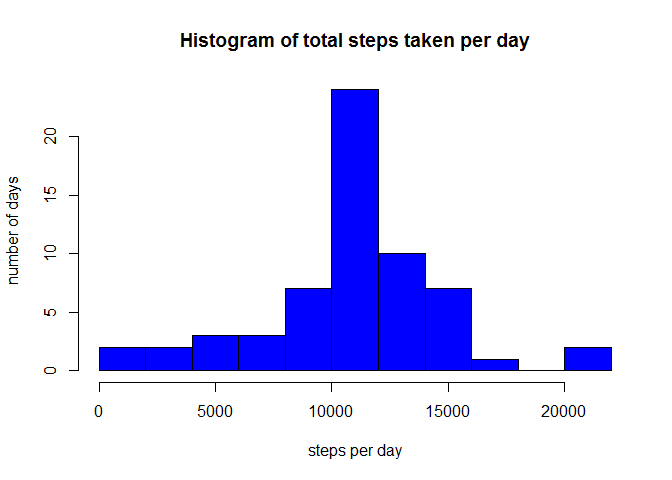

# Reproducible Research: Peer Assessment 1


## Introduction
This report is my submission for the first Course Project of the *Reproducible Research* course on Coursera. 

It is now possible to collect a large amount of data about personal movement using activity monitoring devices such as a Fitbit, Nike Fuelband, or Jawbone Up. These type of devices are part of the "quantified self" movement - a group of enthusiasts who take measurements about themselves regularly to improve their health, to find patterns in their behavior, or because they are tech geeks. But these data remain under-utilized both because the raw data are hard to obtain and there is a lack of statistical methods and software for processing and interpreting the data.

This assignment makes use of data from a personal activity monitoring device. This device collects data at 5 minute intervals through out the day. The data consists of two months of data from an anonymous individual collected during the months of October and November, 2012 and include the number of steps taken in 5 minute intervals each day.

## Loading the data
The data used is from the course website and found [here](https://d396qusza40orc.cloudfront.net/repdata%2Fdata%2Factivity.zip). The variables in the dataset are:

- **steps**: Number of steps taking in a 5-minute interval (missing values are coded as `NA`)

- **date**: The date on which the measurement was taken in YYYY-MM-DD format

- **interval**: Identifier for the 5-minute interval in which measurement was taken

Reading the data and give a summary:

```r
unzip("repdata_data_activity.zip")
activityData <- read.csv("activity.csv")
summary(activityData)
```

```
##      steps                date          interval     
##  Min.   :  0.00   2012-10-01:  288   Min.   :   0.0  
##  1st Qu.:  0.00   2012-10-02:  288   1st Qu.: 588.8  
##  Median :  0.00   2012-10-03:  288   Median :1177.5  
##  Mean   : 37.38   2012-10-04:  288   Mean   :1177.5  
##  3rd Qu.: 12.00   2012-10-05:  288   3rd Qu.:1766.2  
##  Max.   :806.00   2012-10-06:  288   Max.   :2355.0  
##  NA's   :2304     (Other)   :15840
```

```r
activityData$date <- as.Date(activityData$date)
```

## What is the mean total number of steps taken per day?
Before answering this question we will first generate a histogram of the total number of steps taken each day. First we calculate the total number of steps taken per day, then we plot the histogram which will show the distribution of this measure. 

```r
stepsPerDay <- aggregate( steps ~ date, data = activityData, sum)
hist(stepsPerDay$steps,
     col = "blue",
     xlab = "steps per day",
     ylab = "number of days",
     main = "Histogram of total steps taken per day",
     breaks=10)
```

<!-- -->

The mean number of steps taken per day is 1.07662\times 10^{4} and the median is 10765.

## What is the average daily activity pattern?
To find out what the average daily activity pattern is, we make a time-series plot of the average number of steps taken (per day) per 5-minute interval.

```r
avgStepsInterval <- aggregate( steps ~ interval, data = activityData, mean, na.rm = TRUE)
plot(avgStepsInterval,
     type = "l",
     xlab = "Average number of steps")
```

<!-- -->

We see a large spike at the interval 835. Within this interval most steps are taken on average across all days.

## Imputing missing values
As the summary of the data showed, there are a couple of days on which the number of steps taken was missing (`NA`). The number of missing values was 2304. From the summary we could also see that there are 288 intervals on each day. As we zoom in on the rows with missing values we find that there only 8 days for which there are missing values AND that for all of the intervals on these days the number of steps is unknown:

```r
naRows <- narows<-activityData[is.na(activityData$step),]
naRows$date <- as.character(naRows$date)
table(naRows$date)
```

```
## 
## 2012-10-01 2012-10-08 2012-11-01 2012-11-04 2012-11-09 2012-11-10 
##        288        288        288        288        288        288 
## 2012-11-14 2012-11-30 
##        288        288
```

Until now we just ignored these. Instead we could also impute these numbers. One strategy for this is taking the average number of steps taken within an interval on these days. This would make the number of steps on these days 0 and will lower the median and mean of the mean total number of steps taken per day. Another strategy which might be slightly better is to replace the missing values by the average number of steps taken within that 5-minute interval. We already calculated that before, so we will use that result to make the new imputed dataset:

```r
merged <- merge(activityData, avgStepsInterval, by="interval", all.x = TRUE)
merged[ is.na(merged$steps.x), "steps.x"] <- merged[is.na(merged$steps.x), "steps.y"]
imputedDataset <- merged[, c("steps.x","date","interval")]
names(imputedDataset) <- names(activityData)
```

Now we recreate the histogram with this dataset:

```r
stepsPerDay_imp <- aggregate( steps ~ date, data = imputedDataset, sum)
hist(stepsPerDay_imp$steps,
     col = "blue",
     xlab = "steps per day",
     ylab = "number of days",
     main = "Histogram of total steps taken per day",
     breaks=10)
```

<!-- -->

The histogram does not show a different distribution of the steps per day, the frequency of each bin does increase a bit however. We also find that the mean stays the same (10766.19) and median slightly increases, and is equal to the mean.

```r
mean(stepsPerDay_imp$steps)
```

```
## [1] 10766.19
```

```r
median(stepsPerDay_imp$steps)
```

```
## [1] 10766.19
```

## Are there differences in activity patterns between weekdays and weekends?
We will use the imputed data set for this question. First we need to create a factor with two levels, "weekend" and "weekday" based on the date.

```r
datasetWithWeekday <- cbind(imputedDataset, "weekday" = as.numeric(as.factor(weekdays(imputedDataset$date))) )
datasetWithWeekday[datasetWithWeekday$weekday %in% 1:5,"weekday"]<-"weekday"
datasetWithWeekday[datasetWithWeekday$weekday %in% 6:7,"weekday"]<-"weekend"
datasetWithWeekday$weekday <- as.factor(datasetWithWeekday$weekday)
```
Next we create a time series for both weekdays as weekends for the average number of steps taken within an interval:

```r
avgStepsIntervalWeekday <- aggregate( steps ~ interval + weekday, data = datasetWithWeekday, mean, na.rm = TRUE)
library(lattice)
xyplot(steps ~ interval | weekday, 
       data = avgStepsIntervalWeekday, 
       layout = c(1,2), 
       type ="l")
```

<!-- -->

The patterns are quite different for weekdays and weekends, on weekdays the spike is much steeper than on weekends.


